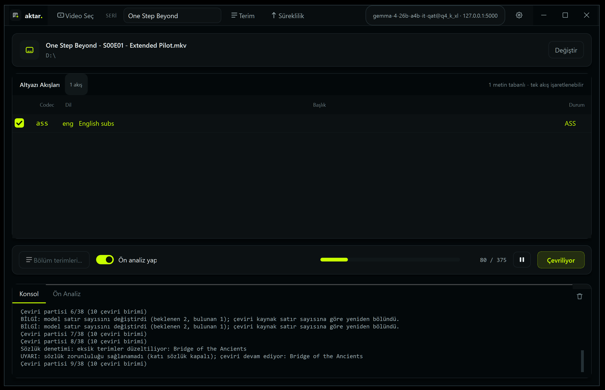

<div align="center">
  <picture>
    <source media="(prefers-color-scheme: dark)" srcset="assets/logo-dark.svg">
    
  </picture>
</div>



Video dosyalarındaki **metin tabanlı altyazıları** çıkarıp, **yerel bir yapay zeka modeliyle Türkçeye çeviren** masaüstü uygulaması.

> **Gizlilik:** Hiçbir veri internet üzerinden gönderilmez. Çeviri tamamen yerel ağdaki LM Studio sunucusunda (`127.0.0.1`) yapılır. Kaynak video dosyası **salt-okunur** kabul edilir; kopyalanmaz, taşınmaz, değiştirilmez veya yeniden encode edilmez.

> **English:** Aktar is a PySide6 desktop app (with a companion CLI) that extracts text subtitles from video files and translates them to Turkish with a local LLM served by LM Studio. Everything runs locally and the source video is treated as read-only. The program preserves subtitle structure, timings, order and ASS tags — while the model only ever sees plain text, and it enforces a glossary for consistent terminology across episodes.

---

## Öne çıkan özellikler

- **Zorunlu terim sözlüğü (glossary):** Çeviride belirtilen terimlerin karşılığı Türkçe çekim ekleriyle birlikte denetlenir; eksikse tek düzeltme turu yapılır.
- **Seri bazlı glossary + süreklilik:** TV dizisi/anime bölümleri arasında isim yazımı, hitap biçimi (sen/siz) ve tekrar eden kalıplar seri düzeyinde saklanır.
- **Yapay zekâ ön analizi:** Kaynak altyazıdan çevrilebilir kurgu terimleri, unvanlar, yerler ve kalıcı süreklilik kararları için Türkçe öneriler üretir; kullanıcı karşılığı düzenleyip yalnız bölüm veya seri kapsamıyla onaylayabilir.
- **Çeviri sonrası öğrenme:** Ön analiz kapalı olsa bile çevirinin sonunda sonraki bölümlerde kullanılabilecek terimler ve süreklilik kararları çıkarılır; kullanıcı onayı olmadan seri terimlerine yazılmaz.
- **Format korunur:** SRT→SRT, ASS→ASS, SSA→SSA, VTT→VTT. Yalnızca `mov_text` SRT'ye dönüştürülür.
- **Türkçe karakter güvenliği:** Kaynak ASS/SSA fontu Türkçe harfleri (`ç ğ ı İ ö ş ü`) çizemiyorsa çıktıda o font otomatik olarak **Calibri** ile değiştirilir.

---

## Gereksinimler

- **Windows** veya Python 3.10+ çalışan herhangi bir masaüstü ortamı.
- **Python 3.10+** (kaynak koddan çalıştırma için).
- **PySide6** (arayüz).
- **FFmpeg / ffprobe:** `bin\ffmpeg.exe` ve `bin\ffprobe.exe` olarak taşınabilir şekilde projeye konur(daha fazla bilgi için bin klasöründe  **[README.txt](bin/README.txt)** 'i okuyabilirsiniz).
- **LM Studio:** yerel sunucu açık olmalı (varsayılan `http://127.0.0.1:1234/v1`) ve bir model yüklü olmalı.

---

## Hızlı başlangıç

Release'deki .exe dosyası veya derlemeden kullanmak istiyorsanız;

```bat
cd /d Z:\LLM-Files\Projects\Aktar
py -3 -m pip install -r requirements.txt
```

1. `bin\` klasörüne `ffmpeg.exe` ve `ffprobe.exe` koyun.
2. LM Studio'da modeli yükleyip yerel sunucuyu başlatın; `config.json` içindeki `base_url` ve `model` alanlarını kendi ayarınıza göre düzenleyin.
3. Arayüzü başlatın:

```bat
GUI_BASLAT.cmd
```

4. Videoyu pencereye sürükleyin → altyazı akışını işaretleyin → **Çevir**.

Ayrıntılı kullanım ve .exe'nin derlenmesi için bkz. **[KULLANIM.md](KULLANIM.md)**.

### Komut satırı (isteğe bağlı)

```bat
py -3 cevir.py check
py -3 cevir.py streams "C:\video\Movie.mkv"
py -3 cevir.py extract "C:\video\Movie.mkv" --stream 2
py -3 cevir.py translate "C:\video\Movie.ass" --series game-of-thrones --glossary "Ash=Kul"
```

---

## Sınırlamalar

- Yalnızca **metin tabanlı** altyazılar desteklenir; görüntü tabanlı altyazılar (PGS/VobSub) çevrilemez.
- Satır ortasındaki karakter bazlı ASS efektleri (`C{\fs38}L...` gibi) modelden uzak tutulup çevrilmiş metindeki oransal konumlarına geri yerleştirilir. Etiketler korunur; kelime sırası değiştiğinde görsel konumları yaklaşık olabilir.
- Çeviri kalitesi seçilen modele ve prompt'a bağlıdır; LM Studio model preset'inde "thinking" kapatılması önerilir (bkz. KULLANIM.md → Sorun giderme).
- Otomatik konuşmacı ayrımı, karaoke zamanlaması veya altyazı zamanlaması düzeltmesi yapılmaz.

---

## Lisans

MIT — bkz. [LICENSE](LICENSE).
